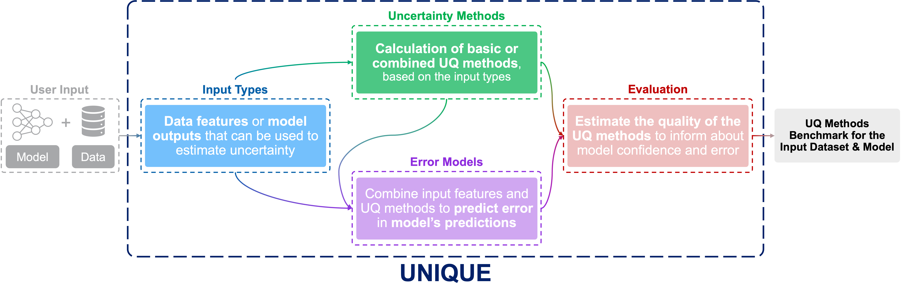
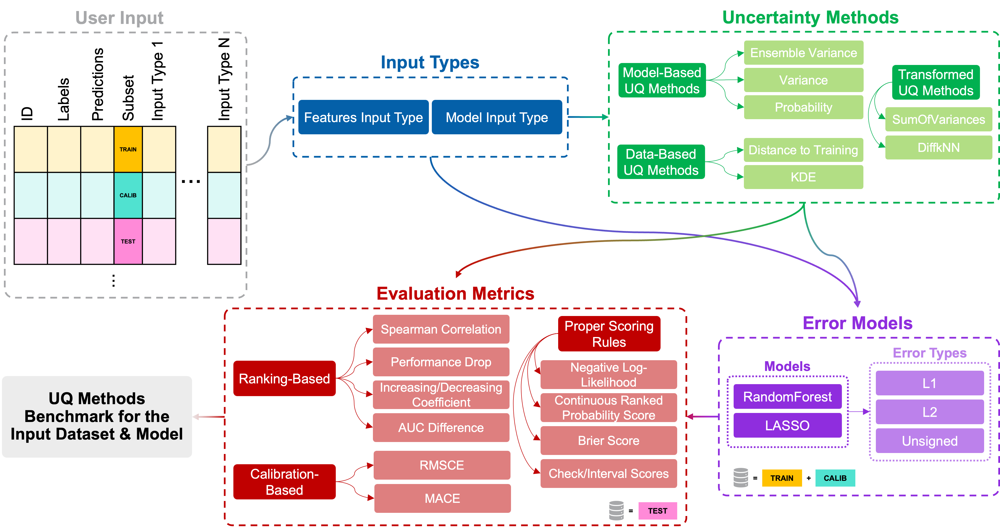

A Python library for benchmarking uncertainty estimation and quantification methods for Machine Learning models predictions.


[](https://opensource.org/licenses/BSD-3-Clause)
[](https://github.com/psf/black)


# UNIQUE (UNcertaInty QUantification bEnchmark)


## Table of Contents

* [Introduction](#introduction)
* [Installation](#installation)
  - [For Developers](#for-developers)
* [Getting Started](#getting-started)
  - [Prepare Your Dataset](#prepare-your-dataset)
  - [Prepare Your Pipeline](#prepare-your-pipeline)
* [Usage](#usage)
  - [Examples](#examples)
* [Overview of `UNIQUE`](#overview-of-unique)
  - [Best UQ Method Selection](#best-uq-method-selection)
  - [List of Available UQ Methods & Objects in `UNIQUE`](#list-of-available-uq-methods--objects-in-unique)
  - [List of Evaluation Metrics](#list-of-evaluation-metrics)
* [Contributing](#contributing)
* [License](#license)
* [Contacts & Acknowledgements](#contacts--acknowledgements)


## Introduction

`UNIQUE` provides methods for quantifying and evaluating the uncertainty of Machine Learning (ML) models predictions. The library allows to combine and benchmark multiple uncertainty quantification (UQ) methods simultaneously, generates intuitive visualizations, evaluates the goodness of the UQ methods against established metrics, and in general enables the users to get a comprehensive overview of their ML model's performances from an uncertainty quantification perspective.

`UNIQUE` is a model-agnostic tool, meaning that it does not depend on any specific ML model building platform or provides any  ML model training functionality. It is lightweight, because it only requires the user to input their model's inputs and predictions.




## Installation

`UNIQUE` is currently compatible with Python 3.8 through 3.12.1. To install the latest release and use the package as is, run the following in a compatible environment of choice:

```bash
pip install git+https://github.com/Novartis/UNIQUE.git
```

> [!TIP]
> To create a dedicated virtual environment for `UNIQUE` using `conda`/`mamba` with all the required and compatible dependencies, check out: [For Developers](#for-developers).

### For Developers

If you wish to work on the codebase itself, check first [how to best contribute to `UNIQUE`](./CONTRIBUTING.md).

> [!WARNING]
> The following steps are recommended only for expert/power-users.

First, clone the repository and check into the project folder.

```bash
git clone https://github.com/Novartis/UNIQUE.git ./unique
cd unique
```

The project uses [`mamba`](https://mamba.readthedocs.io/en/latest/index.html) for dependencies management, which is a faster drop-in replacement for [`conda`](https://conda.io/projects/conda/en/latest/user-guide/install/index.html). If you still wish to use `conda`, you can change the backend solver by adding `--solver=libmamba` to your `conda install` standard command ([see the docs](https://conda.github.io/conda-libmamba-solver/user-guide/#try-it-once)).

To setup the project, run:

```bash
# Install conda environment and jupyter kernel locally
make env && make jupyter-kernel
conda activate .conda/unique
# Setup precommit hooks
make pre-commit
# Install SpeAKit
pip install -e .
# Use `pip install -e .[dev]` to also install optional dependencies
```

In this way, you will have access to the `UNIQUE` codebase and be able to make local modifications to the source code, within the `.conda/unique` environment that contains all the required dependencies. Additionally, if you use Jupyter Notebooks, the `unique-env` kernel will be available in the "Select kernel" menu of the JupyterLab/JupyterNotebook UI. Finally, when using `git` for code versioning, the predefined pre-commit hooks will be run against the commited files for automatic formatting and syntax checks.

You can find out more about custom Jupyter kernels [here](https://ipython.readthedocs.io/en/stable/install/kernel_install.html) and pre-commit hooks [here](https://pre-commit.com/).


## Getting Started

### Prepare Your Dataset

In order to use `UNIQUE` the user only needs to input a dataframe containing at the minimum the following columns:

- **IDs**: a column containing the unique IDs of the datapoints (can be the dataframe's `index` if there are no other identifiers).
- **Labels**: a column containing the target labels/values associated with each datapoint.
- **Predictions**: a column containing the trained ML model's predictions (intended as the final model's, or ensemble of models', single-value output, to be compared with the corresponding label).
- **Subset**: a column containing the specification of which subset each datapoint belongs to. The allowed subsets are: `TRAIN`, `TEST`, and `CALIBRATION`.

> [!CAUTION]
> Make sure to use exactly `TRAIN`, `TEST`, and `CALIBRATION` (all upper-case), as these values are hard-coded.

Then, depending on the UQ methods one wants to evaluate/use, one can add:

- **Data features**: column(s) containing the feature(s) of each datapoint - e.g., the ones used for training the original ML model. These will be used, for example, to compute the distance between each datapoint in the feature's space (therefore, if you wish to aggregate different features together, you need to provide them as a single column comprising of arrays of length _n_, with _n_ being the number of features, one for each datapoint).
- **Model outputs**: column(s) containing output(s) related to the original ML model. For example, it can be a column containing the individual predictions of an ensemble of models (stored as an array of values for each datapoint), before merging them in a single final predicted value, or it can be directly the variance value of the ensemble associated with each datapoint's predictions.

For example, an input dataset to `UNIQUE` could look like this:

|   |ID|Labels|Predictions|Subset|Data Feature|Data Features|Ensemble Predictions|Ensemble Variance|
|--:|-:|:----:|:----------|:-----|:----------:|:-----------:|:------------------:|:---------------:|
|   |1|0.12|0.17|TRAIN|45|[65,12,0.12,True,...]|[0.10,0.12,0.07,0.25,...]|0.02|
|   |2|0.43|0.87|TEST|36|[90,124,15.63,True,...]|[0.43,1.52,0.23,0.45,...]|0.13|
|   |3|4.78|5.62|CALIBRATION|8|[0.9,83,-0.4,False,...]|[1.87,7.92,4.32,5.08,...]|0.81|
|   |...|...|...|...|...|[...]|[...]|...|
|`dtype`|`Any`|`int` or `float`|`int` or `float`|`str`|`int` or `float`|`Iterable` or `np.ndarray`|`Iterable` or `np.ndarray`|`float`|

> [!TIP]
> When storing long arrays/lists in a single `pd.DataFrame` column, saving and reloading the dataframe as a `csv` file will cause issues, due to the fact that each array will be saved as a string when saving in the `csv` format and will be truncated with ellipsis if exceeding a certain limit (typically > 1000 elements per array), thus making it impossible to correctly parse the entire original array when loading the `csv` file again. To overcome this, consider dumping the input dataframe as a `json` or `pickle` file - e.g., with [`pd.DataFrame.to_json`](https://pandas.pydata.org/pandas-docs/stable/reference/api/pandas.DataFrame.to_json.html) or [`pd.DataFrame.to_pickle`](https://pandas.pydata.org/pandas-docs/stable/reference/api/pandas.DataFrame.to_pickle.html), which will not cause any of the aforementioned issues. `UNIQUE` supports input dataframe in `csv`, `json` and `pickle` formats.

> [!CAUTION]
> Only unpickle files you trust. See the [`pickle` module docs](https://docs.python.org/3/library/pickle.html#module-pickle) for more information, and consider safer serialization formats such as `json`.


Check [Examples](#examples) for some practical, hands-on tutorials on data preparation for `UNIQUE`.


### Prepare Your Pipeline

Once the data has been prepared, the easiest way to run `UNIQUE` is through the [`unique.Pipeline`](./unique/pipeline.py) object. `Pipeline` allows you to run the uncertainty quantification benchmark in an end-to-end fashion.

In order to tell `UNIQUE` which inputs to use and which UQ methods to evaluate, you need to prepare a configuration file. This is a `yaml` file which contains all the specifications needed to retrieve and run the `UNIQUE` pipeline.

You can find below a commented example of a typical `yaml` configuration file for your `Pipeline`:

```yaml
#######
# I/O #
#######
# Path to the prepared input dataset
data_path: "/path/to/your/input/dataset.[csv,json,pkl]"
# Path to the output folder where to save UNIQUE's outputs
output_path: "/path/to/output/folder"

########
# Data #
########
# Name of the column containing the unique data IDs
id_column_name: "ID"
# Name of the column containing the labels
labels_column_name: "Labels"
# Name of the column containing the original model's predictions
predictions_column_name: "Predictions"
# Name of the column containing the subset specification ("TRAIN", "TEST", "CALIBRATION")
which_set_column_name: "Subset"
# Name of the original model
model_name: "MyModel"
# Specify which task your model solves: either "regression" or "classification"
problem_type: "regression"

#############
# UQ Inputs #
#############
# List of UNIQUE InputTypes specifying the column name of the inputs and the UQ methods to compute for each of them (if none are specified, all supported UQ methods for each InputType will be computed)
# Note: it needs to be a list, even if only one input type is specified (note the hyphens)
inputs_list:
  # FeaturesInputType are features that can have `int` or `float` values and can be represented as a single value or grouped as a list/array of features for each datapoint
  - FeaturesInputType:
    # Name of the column containing the features (for example here we assume a single value for each datapoint)
      column_name: "Feature"
    # Only the "manhattan_distance" and "euclidean_distance" UQ methods will be computed for this input (note that they are specified as a list using the hyphen)
      metrics:
      - "manhattan_distance"
      - "euclidean_distance"
  - FeaturesInputType:
    # Name of the column containing the features (for example here we assume an array of features for each datapoint)
      column_name: "FeaturesArray"
    # Only "euclidean_distance" UQ method will be computed for this input (note that you can also specify the methods as a single value - no hyphens here)
      metrics: "euclidean_distance"
  # ModelInputType is the variance of the ensemble's predictions
  - ModelInputType:
    # Name of the column containing the variance
      column_name: "Variance"
    # No methods are specified here, which means that all supported UQ methods for this input type will be computed

###################
# UQ Error Models #
###################
# List of UNIQUE ErrorModels specifying available model's hyperparameters as keyword-arguments
# You can specify as many error models as you want, even the same type but with different hyperparameters (GridSearch is not yet implemented in UNIQUE)
# Note: it needs to a list, even if only one error model is specified (note the hyphens)
error_models_list:
  # UniqueRandomForestRegressor is a RF regressor trained to predict the error between the original model's predictions and data labels
  - UniqueRandomForestRegressor:
    # All available arguments to the model can be specified here. See each model's documentation for the full list of arguments. If no hyperparameters are specified, UNIQUE will use the default ones
      max_depth: 10
      n_estimators: 500
    # List of error types to use as target values (note the hyphen). For each error type, a separate model will be built to predict it
    # Supported errors are:
    # "l1" (=absolute error), "l2" (squared error), "unsigned"
      error_type_list:
        - "l1"

#######################
# Evaluation Settings #
#######################
# Whether to plot each UQ method's evaluation plots. Note: the plots of the best UQ methods are always saved (displaying depends on `display_outputs`)
individual_plots: false
# Whether to plot the summary plots with all UQ methods. Note: the summary plots are always saved (displaying depends on `display_outputs`)
summary_plots: true
# Whether to save the enabled plots in the output folder
save_plots: false
# Whether to evaluate the UQ methods against the TEST set only. If "False", evaluation will be carried out for "TRAIN" and "CALIBRATION" sets as well
evaluate_test_only: true
# Whether to display the plots to screen. Only works if running in a JupyterNotebook cell
display_outputs: true
# Number of bootstrapping samples to run. Note: bootstrapping to determine the best UQ metric is ALWAYS run unless the private attribute `Pipeline._bootstrap` is set to False.
n_bootstrap: 500
# Logging messages levels. If True, logger will output DEBUG level messages.
verbose: false
```

> [!NOTE]
> Currently supported UQ methods ("metrics" argument) for `FeaturesInputType` inputs: [`manhattan_distance`](./unique/uncertainty/data_based/distance_to_training.py), [`euclidean_distance`](./unique/uncertainty/data_based/distance_to_training.py), [`tanimoto_distance`](./unique/uncertainty/data_based/distance_to_training.py) (for integer-only inputs), [`gaussian_euclidean_kde`](./unique/uncertainty/data_based/kernel_density.py), [`gaussian_manhattan_kde`](./unique/uncertainty/data_based/kernel_density.py), [`exponential_manhattan_kde`](./unique/uncertainty/data_based/kernel_density.py).
>
> Currently supported UQ methods ("metrics" argument) for `ModelInputType` inputs: [`ensemble_variance`](./unique/uncertainty/model_based/ensemble_variance.py) (for regression tasks only), [`probability`](./unique/uncertainty/model_based/probability.py) (for classification tasks only).
>
> See [List of Available UQ Methods & Objects in `UNIQUE`](#list-of-available-uq-methods--objects-in-unique) for more details.

For more examples of `yaml` configuration files, you can check the [`notebooks`](./notebooks/) folder which contains some examples.


## Usage

Finally, once the data and configuration files have been prepared, you can run `UNIQUE` in the following way:

```python
from unique import Pipeline

# Prepare UNIQUE pipeline
pipeline = Pipeline.from_config("/path/to/config.yaml")

# Run UNIQUE pipeline
uq_methods_outputs, uq_evaluation_outputs = pipeline.fit()
# Returns: (Dict[str, np.ndarray], Dict[str, pd.DataFrame])
```

Fitting the `Pipeline` will return two dictionaries:

- `uq_methods_outputs`: contains each UQ method's name (as in "UQ_Method_Name[Input_Name(s)]") and computed UQ values.
- `uq_evaluation_outputs`: contains, for each evaluation type (ranking-based, proper scoring rules, and calibration-based), the evaluation metrics outputs for all the corresponding UQ methods organized in `pd.DataFrame`.

Additionally, `UNIQUE` also generates graphical outputs in the form of tables and evaluation plots (if `display_outputs` is enabled and the code is running in a JupyterNotebook cell).


### Examples

For more hands-on examples and detailed usage, check out some of the examples in [`notebooks`](./notebooks).


## Overview of `UNIQUE`

`UNIQUE` implements various input types, UQ methods, and evaluation metrics, and allows for an end-to-end uncertainty quantification benchmarking.

Each input type object is associated with a certain real-world input from the user's data; each UQ method directly consists of or can be derived from the input type values; each UQ method is associated with one or multiple evaluation benchmarks and corresponding metrics.





The above schema shows a detailed map of `UNIQUE`'s workflow and objects. From a user's input dataset, `UNIQUE` abstracts two different [input type objects](./unique/input_type): _data_- (or _features_-)and _model_-based input types, that represent the input values necessary to estimate and quantify the uncertainty in model's predictions.

Each input type object can be used either directly as a representation of model's uncertainty or to compute a UQ proxy using associated UQ methods: these methods can either directly derive the UQ estimates from the input data (_base_ UQ methods), or combine several _base_ UQ methods to generate more complex and holistic measures of uncertainty (_transformed_ UQ methods).


> [!NOTE]
> We distinguish between "_base_" UQ methods and "_transformed_" UQ methods. _Base_ UQ methods are methods directly computable from the input data (e.g., `Variance`); instead, _transformed_ UQ methods are a combination of base UQ methods (e.g., `SumOfVariances`) or, more generally, any UQ method derived from transformation/further processing of other UQ methods (e.g., error models use base UQ methods as input training data, and their outputs/predictions are UQ methods themselves - the predicted errors are themselves a model's uncertainty quantification method).


Error models are a novel way to measure uncertainty, and are an example of _transformed_ UQ method, as they combine several input features and _base_ UQ methods to try predicting the error of the model's predictions, as a UQ proxy itself.

Lastly, each UQ method can be evaluated by three different evaluation benchmarks: ranking-based, calibration-based, and proper scoring rules evaluation. Each of these encompasses multiple evaluation metrics, which are established scores, concepts, and functions that are tasked with assessing the quality of the UQ methods with respect to the original data and model.


### Best UQ Method Selection

`UNIQUE` also provides a way to easily identify the best-performing UQ method - i.e., the one whose values most accurately reflect the true errors from the original ML model, depending on the evaluation benchmark being used.

In particular, for `UNIQUE` the best UQ method is the one that best optimizes the following evaluation metrics in each benchmark:

- **Ranking-based Evaluation**: highest Spearman Rank Correlation Coefficient (SRCC).

- **Proper Scoring Rules**: lowest Negative Log-Likelihood (NLL).

- **Calibration-based Evaluation**: lowest Mean Absolute Calibration Error (MACE).

Check out [List of Evaluation Metrics](#list-of-evaluation-metrics) for more details about each evaluation score.

Furthermore, if enabled (true by default), `UNIQUE` performs bootstrapping to ensure the selection is as robust as possible. That is, for each UQ method and each evaluation metrics benchmark, the evaluation score to be optimized is computed on 500 (default value) bootstrap samples of the original dataset and corresponding UQ values. This leads to a distribution of evaluation scores for each UQ method, which is then compared pairwise with the corresponding score distributions from each and every other UQ meethod via a Wilcoxon ranked sum test, to verify whether there are statistically significant differences.

The best UQ method is then the one that achieves the highest number of occurrences in which its evaluation scores distribution is significantly higher/lower (depending on the evaluation method) than the score distribution of another UQ method.

The best UQ method is highlighted in green in the summary tables output by `UNIQUE` and, if enabled, additional individual evaluation plots are generated for the best UQ method.


### List of Available UQ Methods & Objects in `UNIQUE`

Below, you can find an overview of the input types, UQ methods, error models, and evaluation metrics implemented in `UNIQUE`.


|Type|Name|Short Description|Reference(s)|
|---:|---:|:----------------|:-----------|
|Input Type|[`FeaturesInputType`](./unique/input_type/base.py)|Data-based inputs - i.e., features that can be directly computed from/linked to the data. Features can be provided as a single value or as an array of values/features for each datapoint. Numerical features can contain integer-only (binary included) or real-valued (floats) values. See [Prepare Your Dataset](#prepare-your-dataset).||
|Input Type|[`ModelInputType`](./unique/input_type/base.py)|Model-based inputs - i.e., outputs associated with the original predictive model. Depending on the task (`problem_type`, either "classification" or "regression"), two types of model-based inputs can be provided: for classification tasks, the predicted main class probabilities (as a single value per datapoint); for regression tasks, either the individual ensemble member's predictions (as an array) or the pre-computed ensemble variance (as a single value) for each datapoint. See [Prepare Your Dataset](#prepare-your-dataset).||
|UQ Method|[`EnsembleVariance`](./unique/uncertainty/model_based/ensemble_variance.py)|Computes the variance of the ensemble's predictions. Either the individual ensemble member's predictions (as an array) or the pre-computed variance (as a single value) for each datapoint can be provided.||
|UQ Method|[`Probability`](./unique/uncertainty/model_based/probability.py)|Returns the predicted primary class probability. Expects the predicted main class probability value as input, not the ensemble's (class) predictions.||
|UQ Method|[`ManhattanDistance`](./unique/uncertainty/data_based/distance_to_training.py)|Returns the k-nearest neighbors from the training set in the corresponding feature(s) space using the Manhattan distance metric.||
|UQ Method|[`EuclideanDistance`](./unique/uncertainty/data_based/distance_to_training.py)|Returns the k-nearest neighbors from the training set in the corresponding feature(s) space using the Euclidean distance metric.||
|UQ Method|[`TanimotoDistance`](./unique/uncertainty/data_based/distance_to_training.py)|Returns the k-nearest neighbors from the training set in the corresponding feature(s) space using the Tanimoto distance metric.||
|UQ Method|[`GaussianEuclideanKDE`](./unique/uncertainty/data_based/kernel_density.py)|Returns the kernel density estimation from the training set in the corresponding feature(s) space using the gaussian kernel and Euclidean distance metric.||
|UQ Method|[`GaussianManhattanKDE`](./unique/uncertainty/data_based/kernel_density.py)|Returns the kernel density estimation from the training set in the corresponding feature(s) space using the gaussian kernel and Manhattan distance metric.||
|UQ Method|[`ExponentialManhattanKDE`](./unique/uncertainty/data_based/kernel_density.py)|Returns the kernel density estimation from the training set in the corresponding feature(s) space using the exponential kernel and Manhattan distance metric.||
|"Transformed" UQ Method|[`SumOfVariances`](./unique/uq_metric_factory/combinations/sum_of_variances.py)|Computes the sum of (computed) variances and distances converted to variances using the [Calibrated Negative Log-Likelihood](./unique/utils/uncertainty_utils.py) method.|[Hirschfeld _et al._ (2020) - Eq. 11 & 12](https://pubs.acs.org/doi/pdf/10.1021/acs.jcim.0c00502)|
|"Transformed" UQ Method|[`DiffkNN`](./unique/uq_metric_factory/combinations/diffknn.py)|Computes the absolute mean difference in predicted vs. target value for the k-nearest neighbors from the training set in the corresponding feature(s) space.|[Sheridan _et al._ (2022)](https://pubs.acs.org/doi/10.1021/acs.jcim.2c00699)|
|Error Model/"Transformed" UQ Method|[`UniqueRandomForestRegressor`](./unique/error_models/models/random_forest_regressor.py)|Builds and trains a Random Forest regressor that predicts the pointwise prediction error.|Adapted from [Lahlou _et al._ (2023)](https://arxiv.org/abs/2102.08501)|
|Error Model/"Transformed" UQ Method|[`UniqueLASSO`](./unique/error_models/models/LASSO.py)|Builds and trains a LASSO regressor that predicts the pointwise prediction error.|Adapted from [Lahlou _et al._ (2023)](https://arxiv.org/abs/2102.08501)|
|Evaluation Benchmark|[`RankingBasedEvaluation`](./unique/evaluation/base.py)|Computes evaluation metrics that rank predictions based on their actual prediction error vs. the computed UQ values. Generally speaking, the higher the (positive) correlation between prediction error and computed UQ values, the better/more confident the model that produced the predictions can be considered. Currently implemented metrics are: AUC Difference, Spearman Rank Correlation Coefficient, Increasing/Decreasing Coefficient, and Performance Drop. For more information about the methods, see [List of Evaluation Metrics](#list-of-evaluation-metrics).|Inspired by [Scalia _et al._ (2020)](https://doi.org/10.1021/acs.jcim.9b00975), [Hirschfeld _et al._ (2020)](https://pubs.acs.org/doi/pdf/10.1021/acs.jcim.0c00502)|
|Evaluation Benchmark|[`ProperScoringRules`](./unique/evaluation/base.py)|Computes proper scoring rules to evaluate the quality of predictions. Proper scoring rules are functions that assign a scalar summary measure to the performance of distributional predictions, where the maximum score obtainable is reached when the predicted distribution exactly matches the target one (also known as _minimum contrast estimation_). Currently implemented metrics are: Negative Log-Likelihood, Interval Score, Check Score, Continuous Ranked Probability Score, and Brier Score. For more information about the metrics, see [List of Evaluation Metrics](#list-of-evaluation-metrics).|[Gneiting _et al._ (2007)](https://doi.org/10.1198/016214506000001437)|
|Evaluation Benchmark|[`CalibrationBasedEvaluation`](./unique/evaluation/base.py)|Computes model's calibration - i.e., whether the model's predictions are consistent with the underlying target distribution. Currently implemented metrics are: Mean Absolute Calibration Error, and Root Mean Squared Calibration Error. For more information about the metrics, see [List of Evaluation Metrics](#list-of-evaluation-metrics).|[Kuleshov _et al._ (2018)](https://doi.org/10.48550/arXiv.1807.00263)|

<!-- |Error Model/"Transformed" UQ Method|[`UniqueMLPRegressor`](./unique/error_models/models/MLP.py)|Builds and trains a MLP regressor that predicts the pointwise prediction error.|Adapted from [Lahlou _et al._ (2023)](https://arxiv.org/abs/2102.08501)|
|Error Model/"Transformed" UQ Method|[`UniqueMLPVanillaRegressor`](./unique/error_models/models/MLP.py)|Builds and trains a simple MLP regressor that predicts the pointwise prediction error.|Adapted from [Lahlou _et al._ (2023)](https://arxiv.org/abs/2102.08501)| -->


### List of Evaluation Metrics

Below you can find a more in-depth guide to the evaluation scoring metrics implemented in UNIQUE. The source code implementation for these metrics can be found in [`evaluation_metrics.py`](./unique/evaluation/evaluation_metrics.py).


|Evaluation Type|Metric Name|Short Description|Reference(s)|
|--------------:|----------:|:----------------|:-----------|
|Ranking-based|AUC Difference|The AUC measures the ranking capabilities of a model. The difference between the AUC computed using predictions ranked by the original model’s performance metric (e.g., true prediction error) and by the computed UQ method measures the ranking goodness of the UQ method. Lower values are better.|[Yousef _et al._ (2005)](https://doi.org/10.1109/AIPR.2004.18)|
|Ranking-based|Spearman Rank Correlation Coefficient (SRCC)|The SRCC indicates how well the computed UQ method is able to rank the predictions with respect to the original model’s performance metric (e.g., true prediction error). Higher values are better.|[Marino _et al._ (2008)](https://doi.org/10.1016/j.jtbi.2008.04.011)|
|Ranking-based|Increasing/Decreasing Coefficient|A coefficient that measures how “correct” the UQ-based ranking is with respect to the performance metric-based one when binning the ranked predictions (either in increasing or decreasing order) – i.e., the predictions are ranked and binned according to the computed UQ values; the coefficient is then the number of consecutive bins with decreasing performance metric values divided by the number of bins. Higher values are better.||
|Ranking-based|Performance Drop|The drop in performance metric’s value between either the highest and lowest UQ-binned predictions or between the original model’s performance metric on all the predictions and the lowest UQ-binned predictions – i.e., the predictions are ranked and binned according to the computed UQ method; the performance metric is computed for the bins associated with the highest and lowest UQ, and for all the predictions being considered; the score corresponds to the difference in computed performance metrics for highest and lowest UQ-based bins, and for all data and lowest UQ-based bin. Higher values are better.||
|Proper Scoring Rules|Negative Log-Likelihood (NLL)|The NLL assesses how well the predicted probability distribution – i.e., predictions and corresponding computed UQ values, fits the observed data or the error distribution. Lower values are better.|[Maddox _et al._ (2019)](https://doi.org/10.48550/arXiv.1902.02476), [Lakshminarayanan _et al._ (2016)](https://doi.org/10.48550/arXiv.1612.01474), [Detlefsen _et al._ (2019)](https://doi.org/10.48550/arXiv.1906.03260), [Pearce _et al._ (2018)](https://doi.org/10.48550/arXiv.1810.05546)|
|Proper Scoring Rules|Interval Score|The interval score evaluates the sharpness and calibration of a specific prediction interval, rewarding narrow and accurate prediction intervals whilst penalizing wider prediction intervals that do not cover the observation. Lower values are better.|[Gneiting _et al._ (2007)](https://doi.org/10.1198/016214506000001437)|
|Proper Scoring Rules|Check Score (or Pinball Loss)|The check score measures the distance between the computed UQ values (and associated predictions), intended as prediction quantiles, and the true target values. Lower values are better.|[Koenker _et al._ (1978)](https://doi.org/10.2307/1913643), [Chung _et al._ (2020)](https://doi.org/10.48550/arXiv.2011.09588)|
|Proper Scoring Rules|Continuous Ranked Probability Score (CRPS)|The CRPS quantifies the difference between the predicted probability distribution – i.e., predictions and computed UQ values, and the observed distribution. Lower values are better.|[Matheson _et al._ (1976)](https://doi.org/10.1287/mnsc.22.10.1087)|
|Proper Scoring Rules|Brier Score|The Brier Score estimates the accuracy of probabilistic predictions, computed as the mean squared difference between predicted probabilities and the actual outcomes. Lower values are better.|[Brier _et al._ (1950)](https://doi.org/10.1175/1520-0493(1950)078%3C0001:VOFEIT%3E2.0.CO;2)|
|Calibration-based|Mean Absolute Calibration Error (MACE)|The MACE assesses the calibration of the predicted probabilities or intervals, by comparing the bin-wise absolute calibration errors between predicted and observed distributions. Lower values are better.||
|Calibration-based|Root Mean Squared Calibration Error (RMSCE)|The RMSCE assesses the calibration of the predicted probabilities or intervals, by comparing the bin-wise root mean squared calibration errors between predicted and observed distributions. Lower values are better.||


## Contributing

Any and all contributions and suggestions from the community are more than welcome and highly appreciated. If you wish to help us out in making `UNIQUE` even better, please check out our [contributing guidelines](./CONTRIBUTING.md).

Please note that we have a [Code of Conduct](./CODE_OF_CONDUCT.md) in place to ensure a positive and inclusive community environment. By participating in this project, you agree to abide by its terms.


## License

UNIQUE is licensed under the BSD 3-Clause License. See the [LICENSE](./LICENSE) file.


## Contacts & Acknowledgements

For any questions or further details about the project, please get in touch with any of the following contacts:

* **[Jessica Lanini](mailto:jessica.lanini@novartis.com?subject=UNIQUE)**
* **[Minh Tam Davide Huynh](mailto:tamdavide.huynh@gmail.com?subject=UNIQUE)**
* **[Gaetano Scebba](mailto:gaetano.scebba@novartis.com?subject=UNIQUE)**
* **[Nadine Schneider](mailto:nadine-1.schneider@novartis.com?subject=UNIQUE)**
* **[Raquel Rodríguez-Pérez](mailto:raquel.rodriguez_perez@novartis.com?subject=UNIQUE)**


